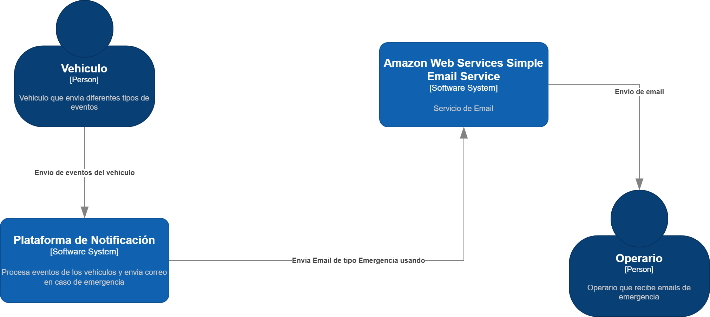
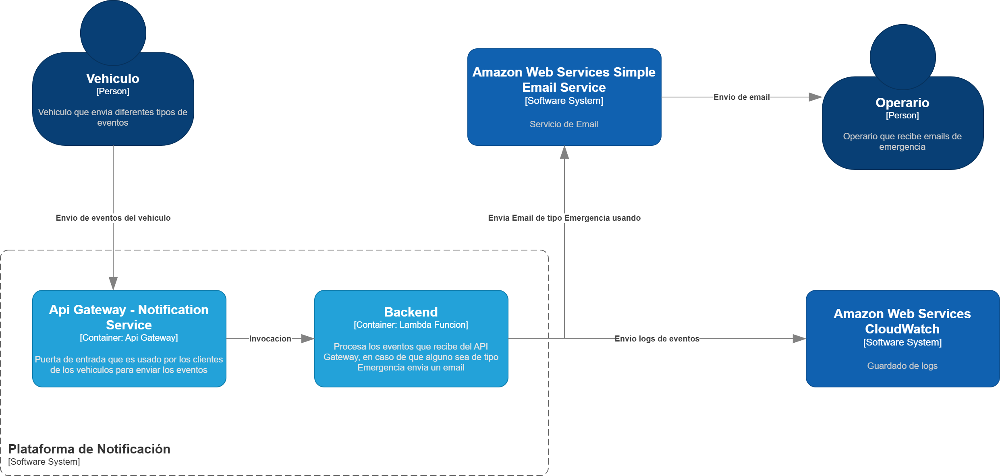
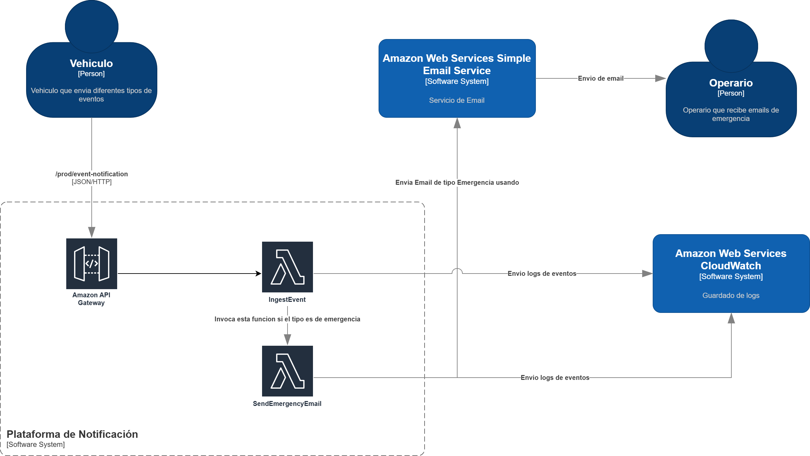

# Reto 2 – Plataforma de Notificación de Emergencias (Serverless en AWS)

Este documento describe la arquitectura propuesta para el reto de **recibir eventos de flota**, **detectar emergencias** y **enviar correos**.

---

## 1. Visión General

El sistema expone un endpoint HTTP (`POST /event-notification`) que recibe eventos de posición y un único evento de tipo `Emergency` durante la prueba de carga con **k6**.  

La solución:

- Debe procesar **1000 eventos en 30 segundos con 100 % de éxito**.
- Debe enviar un correo de alerta para el evento `Emergency` en menos de **30 segundos** desde su recepción.
- Debe respetar los límites de **15 requests/segundo** en API Gateway y **10 instancias concurrentes** de cómputo.

---

## 2. Decisiones de Arquitectura

Las decisiones de esta solución se tomaron priorizando **desempeño (latencia/throughput)** y **disponibilidad**.

### 2.1 Estilo Arquitectónico

- **Estilo principal:** arquitectura **serverless** basada en eventos en la nube (AWS).
- **Patrón C&C dominante:** canal de mensajes síncrono (HTTP) para ingestión + invocaciones asíncronas para trabajo pesado (envío de correo).
- **Módulos bien definidos:** API de entrada, procesamiento de eventos, envío de correo y observabilidad, alineados con la recomendación de separar responsabilidades y favorecer el cambio local.

**Justificación:**  
Este estilo permite escalar automáticamente con mínima operación, absorber picos cortos de carga (prueba k6) y mantener baja la latencia percibida sin gestionar servidores.

### 2.2 Componentes y Servicios

1. **AWS API Gateway (HTTP API)**
   - Expone `POST /prod/event-notification`.
   - Configurado con `throttling_rate_limit = 15 rps` y un **burst alto (≈1000–2000)** para cumplir la restricción de 15 rps.
   - Actúa como *front door* seguro (HTTPS, validación básica).

2. **Lambda `IngestEvent`**
   - Runtime ligero (Node.js).
   - `reserved_concurrent_executions = 10` para respetar el límite de instancias del reto.
   - Responsabilidades:
     - Parsear y validar el JSON.
     - Registrar log de recepción (`event_received`).
     - Detectar `type === "Emergency"` y registrar log (`emergency_detected`).
     - Invocar de forma **asíncrona** a `SendEmergencyEmail`.
   - Devuelve `HTTP 200` lo más rápido posible para maximizar throughput.

3. **Lambda `SendEmergencyEmail`**
   - Encapsula la lógica de notificación.
   - Recibe `emergencyEvent` y `receivedAt`.
   - Envía el correo usando **Amazon SES** a una cuenta de Gmail.
   - Registra log (`email_sent`) con timestamp de envío.

4. **Amazon SES**
   - Servicio gestionado de correo saliente.
   - Evita gestionar SMTP propio y mejora confiabilidad y latencia de entrega.

5. **CloudWatch Logs**
   - Almacena los logs de ambas Lambdas:
     - Recepción del evento `Emergency`.
     - Envío exitoso del correo.
   - Sirve como evidencia para el entregable de **Logs de ejecución**.

6. **IAM**
   - Roles mínimos para cada Lambda:
     - `IngestEvent`: escribir logs + invocar `SendEmergencyEmail`.
     - `SendEmergencyEmail`: escribir logs + llamar a SES.
   - Siguiendo la táctica de **“least privilege”** para seguridad.

---

## 3. Atributo de Calidad más Importante

### 3.1 Atributo priorizado: **Desempeño (Performance)**

En este reto, el objetivo principal es:

> *Procesar 1000 eventos en 30 segundos, detectar el evento de emergencia y enviar el correo en menos de 30 segundos, sin errores.*

Este objetivo combina:

- **Throughput**: volumen de requests/segundo que el sistema puede soportar.
- **Latencia**: tiempo entre recepción del evento y respuesta/envío de correo.

### 3.2 Otros atributos relevantes

- **Disponibilidad:** no perder el evento `Emergency` y evitar errores 5xx/429 durante la prueba.
- **Escalabilidad:** soportar flota mayor en el futuro aumentando concurrencia y/o añadiendo colas/streams.
- **Modificabilidad/Integrabilidad:** poder cambiar el proveedor de correo o añadir persistencia sin reescribir la API.

---

## 4. Escenarios de Arquitectura (Quality Attribute Scenarios)

### 4.1 Escenario P1 – Throughput y latencia del endpoint

- **Fuente:** herramienta de pruebas k6 (actuando como múltiples clientes externos).
- **Estímulo:** se envían **1000 peticiones HTTP POST** con payloads válidos a `/prod/event-notification` en una ventana de **30 segundos**.
- **Entorno:** operación normal, API Gateway con `rate = 15 rps`, Lambdas desplegadas.
- **Artefacto:** API Gateway + Lambda `IngestEvent`.
- **Respuesta:**  
  - Todas las solicitudes son aceptadas y procesadas.  
  - La Lambda `IngestEvent` responde `HTTP 200` a cada request.  
  - El evento `Emergency` genera una invocación asíncrona a `SendEmergencyEmail`.
- **Medida de respuesta:**  
  - **1000/1000** respuestas 2xx, sin 4xx/5xx por throttling o errores.  
  - **Promedio de latencia** del endpoint `< 300 ms`.  
  - **P95 de latencia** `< 500 ms`.

---

### 4.2 Escenario P2 – Latencia de la notificación de emergencia

- **Fuente:** el mismo generador k6, al enviar el único evento con `type = "Emergency"`.
- **Estímulo:** llega un POST con `type = "Emergency"` y datos de vehículo/posición.
- **Entorno:** operación en modo normal, bajo carga (restantes 999 eventos de posición).
- **Artefacto:** Lambda `IngestEvent`, Lambda `SendEmergencyEmail`, SES.
- **Respuesta:**  
  - `IngestEvent` detecta el tipo `Emergency` y registra log de recepción.  
  - `IngestEvent` invoca asíncronamente `SendEmergencyEmail`.  
  - `SendEmergencyEmail` construye y envía el correo vía SES.  
  - El operador puede ver el correo en Gmail.
- **Medida de respuesta:**  
  - Tiempo entre `receivedAt` y `sentAt` en logs `< 30 segundos` (objetivo ideal \< 15s).  
  - El correo llega correctamente (sin rebotes) a la bandeja de entrada configurada.

---

### 4.3 Escenario A1 – Disponibilidad durante la prueba

- **Fuente:** mismos clientes de la prueba de carga.
- **Estímulo:** ráfaga de 1000 solicitudes en 30 s.
- **Entorno:** picos de carga de corta duración, sin fallas de infraestructura.
- **Artefacto:** API Gateway + Lambdas.
- **Respuesta:** el sistema mantiene el servicio operativo, sin caídas ni restart manual.
- **Medida de respuesta:**  
  - 100 % de disponibilidad durante la ejecución de k6.  
  - 0 errores de despliegue / timeouts de plataforma.

---

## 5. Tácticas de Arquitectura

### 5.1 Tácticas para Desempeño

1. **Controlar la demanda de recursos mediante throttling**
   - Implementado en API Gateway con `throttling_rate_limit = 15`.
   - Permite mantener la carga pico dentro de los límites aceptados por la plataforma, evitando sobrecargar Lambdas.

2. **Separar la ruta crítica usando procesamiento asíncrono**
   - El envío de correo se desacopla de la respuesta HTTP usando `InvocationType = "Event"` en la invocación de `SendEmergencyEmail`.
   - Esto reduce la latencia del endpoint y sigue la táctica de **“introducir concurrencia / asynchrony”** para mejorar tiempo de respuesta.

3. **Uso de servicios gestionados altamente optimizados**
   - Serverless (Lambda) y SES aprovechan optimizaciones internas de AWS para colas, recursos de red y escalado.

### 5.2 Tácticas para Disponibilidad

1. **Replicación dinámica de componentes de cómputo**
   - Lambda escala horizontalmente hasta el límite de concurrencia configurado, siguiendo la táctica de **“mantener múltiples copias de componentes”** descrita para disponibilidad.

2. **Eliminación de single point of failure**
   - No hay servidores propios; la disponibilidad se apoya en servicios gestionados con redundancia interna (API Gateway, Lambda, SES).

3. **Registro detallado de eventos críticos**
   - Logs en CloudWatch permiten detectar rápidamente fallos en el flujo `Emergency → Email`, alineado con las tácticas de monitoreo y detección de fallas. 

### 5.3 Tácticas para Modificabilidad / Integrabilidad

1. **Encapsular servicios externos detrás de interfaces claras**
   - `SendEmergencyEmail` es el único punto que conoce SES. Cambiar a otro proveedor de correo o añadir canales (SMS, Slack) solo impactaría esta Lambda.
   - Ejemplo de separar productores y consumidores y ocultar detalles volátiles, como se recomienda para mejorar modifiabilidad. 

2. **Uso de configuración en entorno**
   - Correos destino, asunto, etc. se parametrizan vía variables de entorno, reduciendo cambios de código.

---

## 6. Diagramas de Arquitectura (C4)

A continuación se presentan los diagramas en formato C4.

### Diagrama de Contexto:

### Diagrama de Contenedores:

### Diagrama de Componentes:

